# 计算机系统要素课程笔记

掠过细节，主要目的是熟悉计算机整个生态圈的基础知识，尽量绕过细节，避免精力消耗。

其他参考材料：

* [B站搬运的, 很 nice 的介绍计算机知识的视频](https://www.bilibili.com/video/BV1EW411u7th)

## project 00

下载课件材料并 setup 实验环境。

* https://www.nand2tetris.org/ 课程网站，包含课件，每章节内容(也就是压根没必要下载电子书)，问答网站
* [B站对应的视频教程](https://www.bilibili.com/video/BV1KJ411s7QJ?from=search&seid=12405874849217521087&spm_id_from=333.337.0.0) 带字幕的，很良心
  
**仿真软件安装**

这个软件包含在课件包里，是开包即用的。最好去官方网站下载，项目里我也放了备份。整个可见才 700+k, 妈妈咪呀。

使用方法：

* 安装 JDK，输入 `java -version` 有提示即可
* 解压 zip，到 tools 文件夹下运行 chmod +x HardwareSimulator.sh 赋予执行权
* sh ./HardwareSimulator.sh 即可看到软件 UI

## project 01

布尔代数的一些规则：

| 规则                     | 表达式                                                                          |
| :----------------------- | :------------------------------------------------------------------------------ |
| Commutative 交换律       | x And y = y And x; x Or y = y Or x                                              |
| Associative 结合律       | x And (y And z) = (x And y) And z; x Or (y Or z) = (x Or y) Or z                |
| Distributive 分配律      | x And (y Or z) = (x And y) Or (x And z); x Or (y And z) = (x Or y) And (x Or z) |
| De Morgan 迪摩根定律     | Not(x And y) = Not(x) Or Not(y); Not(x Or y) = Not(x) And Not(y)                |
| Idempotent 幂等          | x And x = x; x Or x = x                                                         |
| Double negation 双重否定 | Not(Not(x)) = x                                                                 |

看完了视频，讲解了很多前置知识，但是看到题目时，一脸懵逼。这里可以参考一下官网对应的 PPT，他里面实验内容更多一点，但是也没多少。

结合我自己的已有知识，感觉直接去找对应的芯片，并拔下来对应的实现逻辑辉更方便一点。就我个人的学习目的来说，完全可以。这部分属于数字电路设计内容了，有兴趣可以再扩展学一下。

### 各个门实现资料收集

[wiki](https://en.wikipedia.org/wiki/NAND_logic) 上有推到过程 

not gate - 非门: NOT(A) = A NAND A

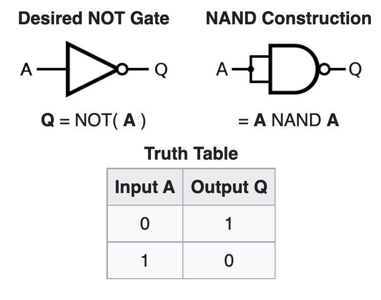

and - 与门: AND = NAND + NOT

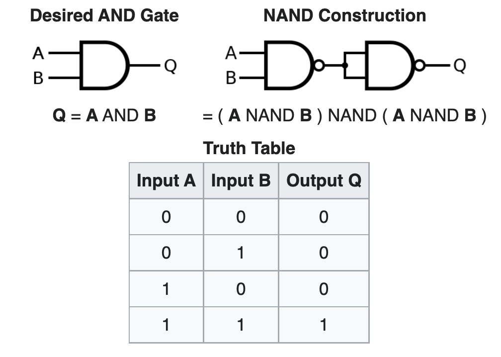

or - 或门: x or y = Not(Not(x) and Not(y))

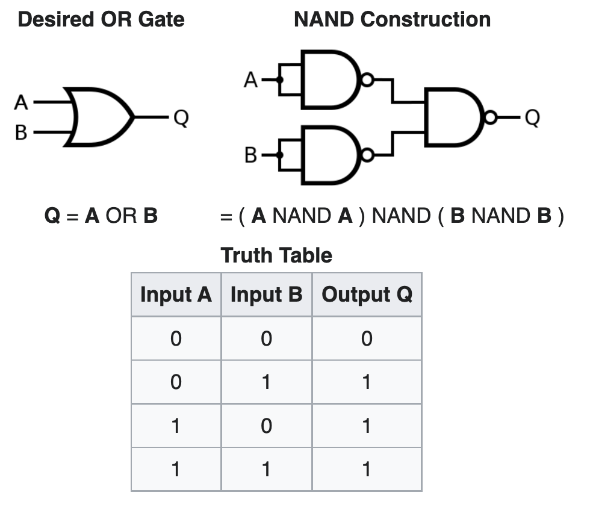

xor - 异或门

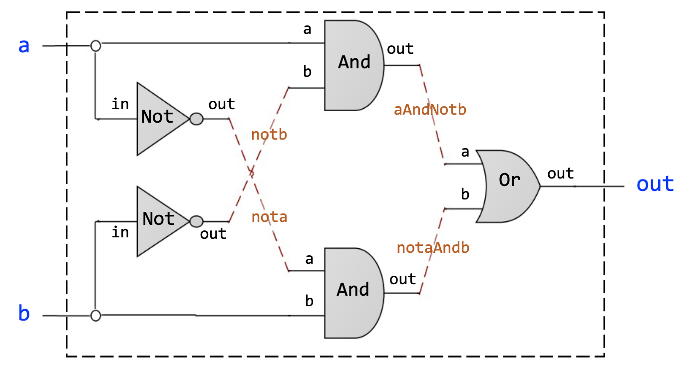

课件中已经给出了实现，写实现的时候顺便可以熟悉一下仿真软件。

mux - 选择器

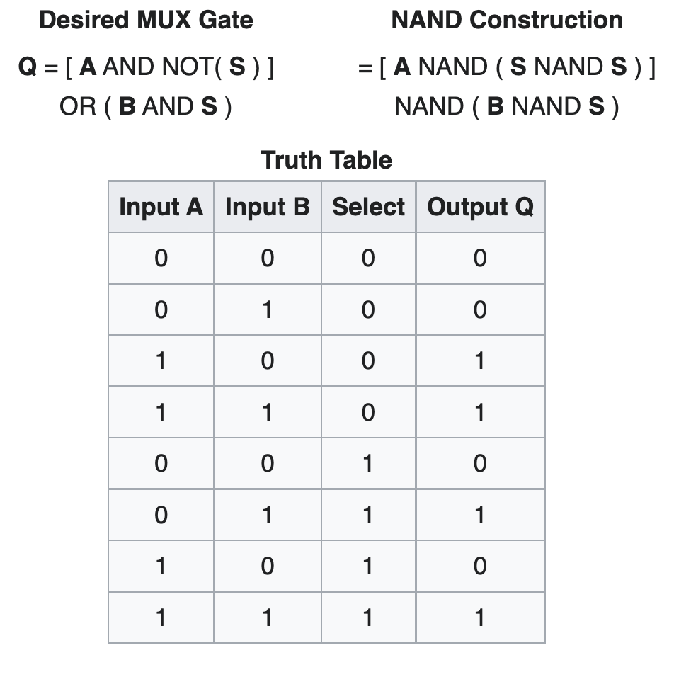

demux - 分解器, mux 的反向实现，一个输入，根据 sel 的不同，输出到不同的出口

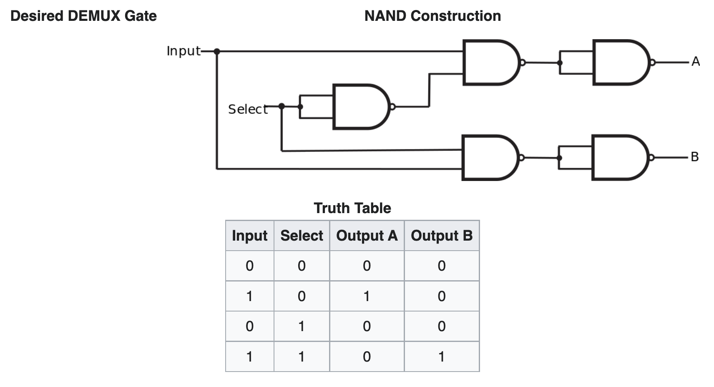

And16 - 16位与操作

DMux4Way 4路分配器，虽然我推导不出来，但是看着答案可以画出来，可以理解

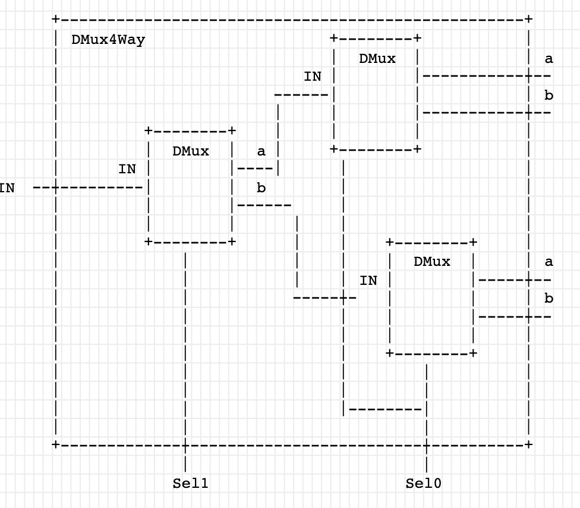

其他逻辑门也是同样的结果，是不是很清楚推导过程，但是我倾向于，这部分只要了解一个知识点就行，那就是这些逻辑门都是可以由 NAND 构建的即可。如果后面课程确实需要构建细节做基础，可以再回头看看

## project 02

half add - 半加器

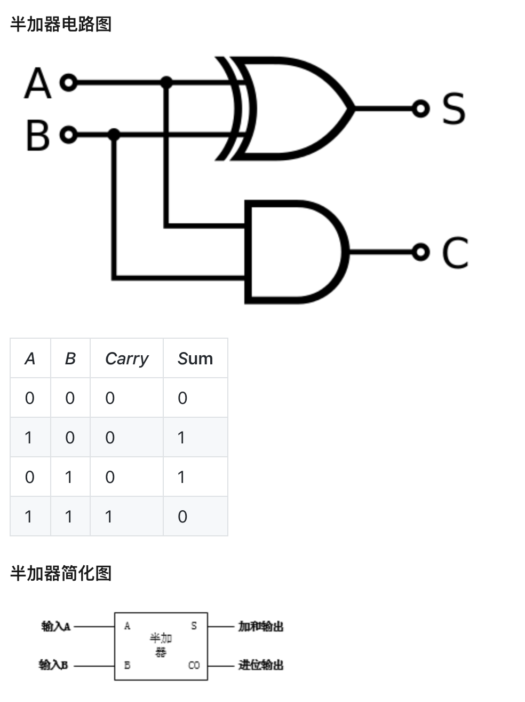

full add - 全加器

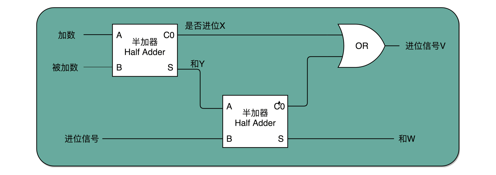

后面的实现顺序为 Add16 -> Inc16, 大致思路知道，但是一些语法细节还是要看答案

ALU 参考这个视频：[YouTube](https://www.youtube.com/watch?v=3bgMUGdGcBU)

## project 03

最简单的触发器 R-S(Reset-Set) 触发器

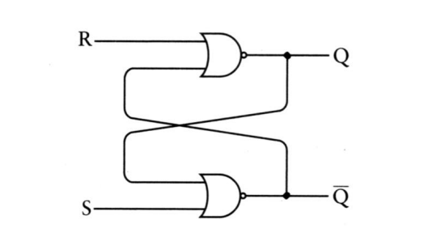
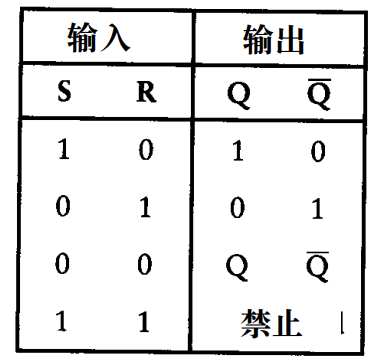

D 型锁存器 - 电平有效

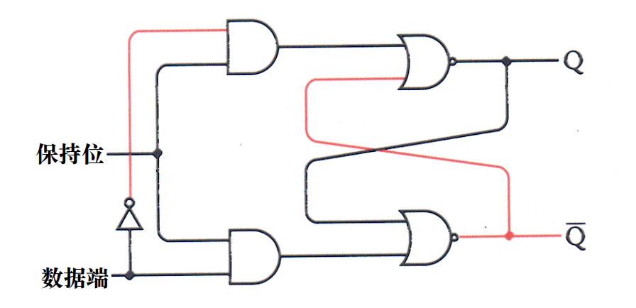
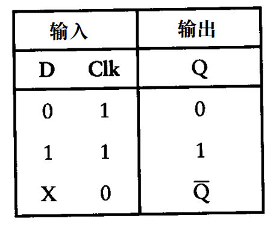

D 型边沿触发器，由他可以扩展出行波计数器，这个扩展简直 666 啊
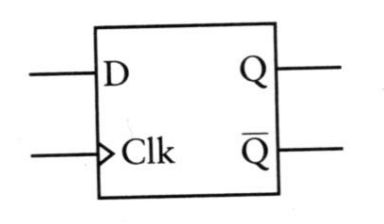

触发器实现时钟功能，寄存器实现存储功能

作业中的内存芯片阵列都是一个套路，一个会了，后面都是套路

## project 04

这节课是个小坎，需要结合一下 汇编 语言的一些知识来理解。实在不行，可以先花一个星期学一下 王爽 老师的 汇编语言 再回头来看。

机器语言即：利用处理器和寄存器操作内存。

计算机的 CPU 只和内存做交互，其他外围设备在内存中有映射，当操作这些内存时就相当于操作外设了。

主要涉及到的硬件概念：

* 内存 - 存储单元
* 处理器(CPU)
* 靠近 CPU，高速存储

Hack 语言规范：

* 内存地址空间分为 指令内存 和 数据内存
* 地址描述 15 位
* 寄存器：D 和 A，都是 16 位
* D 只存储数据
* A 可存数据，也可以作为地址存储器，即根据上下文，A 中内容可以为数值，数据存储器中的地址，或者指令存储器中的地址
* 内存的存取指令是对 M 的隐式操作
* M 指向 A 当前值
* jump 总是跳转到 A 指定的地址
* @value 会将特定的值存到 A 中

Hack 包含两种指令：地址指令(A指令) 和 计算指令(C指令)

* A指令位 A 寄存器设置 15 为的值，@value
* A 指令是将常数输入计算机的唯一途径
* 供 M 使用，作为 C 指令参数
* 为跳转提供地址

M 是用来内存寻址的，A是直接的数字，一个直接的例子如下

```asm
// D=10
@10
D=A

// D=RAM[17]
@17
D=M
```

`A=D+M` 是一个指针操作

Hack 中当你用 A 的时候就代表是常数操作，比如

```asm
@sum
D=D+A // 如果 sum 是第一个变量，则等价于 D=D+16
D=D+M // 如果 sum 地址对应的值为 3，则等价于 D=D+3
```

循环的那个例子里面 (LOOP) 这种语法没讲就用了。。。很晦涩

C 指令解决三个问题：计算什么，计算后的值存在哪里，下一步做什么。语法 `dest=comp;jump`

有 jump 的 C 指令中不能使用 M 寄存器

屏幕映射的一个小细节：之前一直搞混映射关系，感觉 256*512 ～ 13K， 而书上说的，屏幕地址 0X4000, 键盘 0x6000 中间只有 8K 个间隔，拿屏幕的内容不是超出设定的大小了咩？

后来仔细看了好几遍，这个是像素，每个像素对应 1bit, 也就是说一行有 512bit - 32*16bit - 32 个地址，32 * 256 刚好是 8K，匹配上了。

改变屏幕颜色的时候有一个很蹩脚的操作

```asm
@SCREEN
M=-1 // 将 0x4000 地址的值变为 -1
@R0
M=-1 // 将 0 地址的值变为 -1，但是这并不是我想要的效果，我想要的是 R0 的值所代表的地址的位置值改变，更像是 [@R0] = -1 这种感觉

A=M // 从答案来看，这个语法会把 M 指向 R0 值在的地址。。。。好别扭
```

语法还说看的云里雾里，感觉还是书上对语法规则没有交代清楚，可以先练习做下去，等编译器那块看完回头再看应该会好很多。